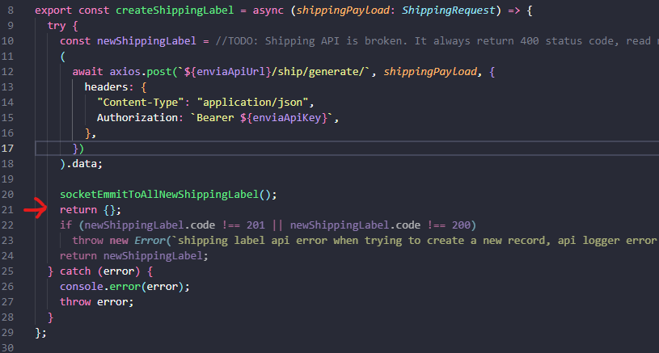

# Tendencys Test Backend

### Instructions
Desarrollar un contador en tiempo real utilizando sockets, ya sea en Node.js o PHP. Este contador debe incrementarse cada vez que se genere una guía a través de la API proporcionada. Es esencial que el contador persista entre pestañas para garantizar su actualización en tiempo real. A continuación, se detallan los pasos y puntos a tener en cuenta:

### Preview Solution


### Comments
When I was making this app, the Envia Shipping Software's API was not working and kept giving me 400 errors.


To get around the problem and finish the test on time, I changed the original code so it would pretend everything was okay.



Tank you!

## Pre-requisites
* git installed on your machine
* nodejs on your terminal
* access to use command line tools (e.g., WSL, PowerShell, etc.)

## Installation
### Follow these steps to correctly run the app. Execute these commands in your favorite terminal.
### 1-. Clone the  [Repository](https://github.com/LuisGerar321/tendencys_test_app) in your preferred  folder e.g. "/home/luis"
```
git clone https://github.com/LuisGerar321/tendencys_test_app.git
```
### 2-. Install the modules required to run the project on both client-side and server-side:

```
cd tendencys_test_app/client
npm i
cd ..
cd tendencys_test_app/server
npm i
```
### 3-. Configure Server-Side (Backend)
### In the server folder 'tendencys_test_app/server', create a new file named '.env' and paste the following environment variables to properly run the backend:
```
## Server Configuration
HOST = "localhost"
PORT = "3001"
PROTOCOL = "http"

# API KEY
SHIPPING_ENVIA_ACCESS_KEY = "Your 'envia' api key"
SHIPPING_ENVIA_URL = "https://api-test.envia.com/"
```
#### Customize the variables as needed by inserting your API key.

### 4-. Configure Client-Side (FrontEnd)

### In the client folder 'tendencys_test_app/client', open the already existing '.env' file and ensure that the API_URL is pointing to the server's running port or modify it if needed. If the backend is running on port 3001, it should look something like this:
```
REACT_APP_API_URL = "http://localhost:3001"
```
### 2-. Running the apps
#### In a new terminal located at 'tendencys_test_app/server' folder, run:
```
npm run watch
```
#### In a new terminal located at 'tendencys_test_app/client' folder, run:
```
npm run start
```


## Testing the app

### Open two Chrome tabs with your Client Application URL, e.g., "http://localhost:3000/". You should see a delivery truck animation and a counter in each one.


### To increment the shipping label counter in real time for all clients, you need to create a new Shipping Label. So, open your Postman App (an API testing tool that allows for easy validation of API responses) and make a new POST HTTP request to your backend "http://localhost:3001/shipping" with the following payload:

```
{
    "origin": {
        "name": "Mariana Mendoza",
        "company": "house",
        "email": "mariana@gmail.com",
        "phone": "8116300800",
        "street": "Merida centro",
        "number": "1400",
        "district": "Mérida",
        "city": "Merida",
        "state": "YU",
        "country": "MX",
        "postalCode": "66236",
        "reference": ""
    },
    "destination": {
        "name": "luis",
        "company": "anothr",
        "email": "dojas64@gmail.com",
        "phone": "9992657990",
        "street": "calle 46 e entre 141 y 143",
        "number": "913",
        "district": "fracc. las palmas",
        "city": "Merida",
        "state": "YU",
        "country": "MX",
        "postalCode": "99349",
        "reference": ""
    },
    "packages": [
        {
            "content": "camisetas rojas",
            "amount": 2,
            "type": "envelope",
            "dimensions": {
                "length": 2,
                "width": 5,
                "height": 5
            },
            "weight": 63,
            "insurance": 0,
            "declaredValue": 400,
            "weightUnit": "KG",
            "lengthUnit": "CM"
        },
        {
            "content": "camisetas rojas",
            "amount": 2,
            "type": "box",
            "dimensions": {
                "length": 1,
                "width": 17,
                "height": 2
            },
            "weight": 5,
            "insurance": 400,
            "declaredValue": 400,
            "weightUnit": "KG",
            "lengthUnit": "CM"
        }
    ],
    "shipment": {
        "carrier": "fedex",
        "service": "express",
        "type": 1
    },
    "settings": {
        "printFormat": "PDF",
        "printSize": "STOCK_4X6",
        "comments": "comentarios de el envío"
    }
}

```
